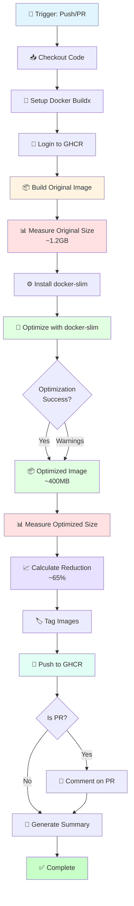
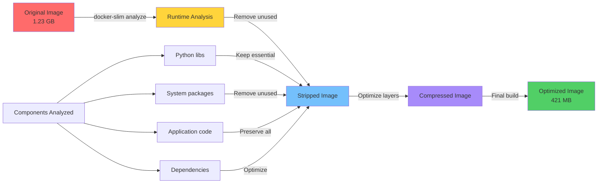

# CI/CD Setup Guide - Docker Build & Optimization

Hướng dẫn thiết lập và sử dụng CI/CD pipeline để tự động build, tối ưu và deploy Docker images.

## 📋 Mục lục

- [Giới thiệu](#giới-thiệu)
- [Prerequisites](#prerequisites)
- [Setup GitHub Container Registry](#setup-github-container-registry)
- [Workflows có sẵn](#workflows-có-sẵn)
- [Cách sử dụng](#cách-sử-dụng)
- [Tối ưu Docker Image](#tối-ưu-docker-image)
- [Troubleshooting](#troubleshooting)

## 🎯 Giới thiệu

Pipeline CI/CD này tự động:

1. ✅ Build Docker images từ source code
2. 📊 Thu thập metrics về size của image
3. ⚙️ Tối ưu image bằng docker-slim (giảm 40-70% size)
4. 📈 So sánh size trước và sau tối ưu
5. 🚀 Push images đã tối ưu lên GitHub Container Registry
6. 💬 Báo cáo kết quả trong PR comments

### 📊 Workflow Visualization



### 🔄 Image Optimization Flow



## 📦 Prerequisites

### 1. GitHub Repository Settings

Đảm bảo repository của bạn có:

✅ **Actions enabled**
- Vào `Settings` → `Actions` → `General`
- Chọn "Allow all actions and reusable workflows"

✅ **Packages enabled**
- Vào `Settings` → `Actions` → `General`
- Trong "Workflow permissions", chọn "Read and write permissions"
- Check ✅ "Allow GitHub Actions to create and approve pull requests"

### 2. Local Development

Cài đặt các tools cần thiết:

```bash
# Docker
docker --version  # >= 20.10

# Docker Buildx
docker buildx version

# Git
git --version
```

## 🔐 Setup GitHub Container Registry

### Bước 1: Verify Permissions

Workflow sẽ tự động sử dụng `GITHUB_TOKEN` để push images. Token này được tạo tự động và có đầy đủ permissions.

### Bước 2: Package Visibility

Sau lần push đầu tiên:

1. Vào GitHub profile → `Packages`
2. Chọn package `createvideo`
3. Click `Package settings`
4. Trong "Danger Zone", có thể chọn:
   - **Public**: Ai cũng có thể pull (recommended cho open source)
   - **Private**: Chỉ collaborators mới pull được

### Bước 3: Link Package to Repository

1. Trong Package settings
2. Scroll xuống "Connect repository"
3. Chọn repository `CreateVideo`
4. Click "Connect"

## 🔄 Workflows có sẵn

### 1. `docker-build-optimized.yml` (Main Workflow)

**Tự động chạy khi:**
- Push to `main` branch
- Push to `develop` branch  
- Tạo Pull Request to `main`

**Manual trigger:**
```bash
# Vào GitHub → Actions → "Build and Optimize Docker Image" → Run workflow
```

**Các bước thực hiện:**
```
┌─────────────────────────┐
│   Checkout Code         │
└───────────┬─────────────┘
            │
┌───────────▼─────────────┐
│   Build Original Image  │
│   Size: ~1.2GB          │
└───────────┬─────────────┘
            │
┌───────────▼─────────────┐
│   Docker-slim Optimize  │
│   Analyze & Minify      │
└───────────┬─────────────┘
            │
┌───────────▼─────────────┐
│   Build Optimized Image │
│   Size: ~400MB          │
│   Reduction: 66%        │
└───────────┬─────────────┘
            │
┌───────────▼─────────────┐
│   Push to GHCR          │
└─────────────────────────┘
```

### 2. `docker-quick-build.yml` (Quick Test)

**Manual trigger only:**
- Dùng để test build nhanh
- Không optimize với docker-slim
- Option để push hoặc không push to registry

## 🚀 Cách sử dụng

### Scenario 1: Push code lên main branch

```bash
# Commit your changes
git add .
git commit -m "feat: add new feature"
git push origin main
```

→ Workflow tự động chạy → Build & optimize → Push to GHCR

### Scenario 2: Tạo Pull Request

```bash
# Create feature branch
git checkout -b feature/new-feature

# Make changes and commit
git add .
git commit -m "feat: implement new feature"
git push origin feature/new-feature
```

→ Tạo PR trên GitHub → Workflow chạy → Comment kết quả size comparison trên PR

### Scenario 3: Quick test build

1. Vào GitHub → `Actions`
2. Chọn "Quick Docker Build"
3. Click "Run workflow"
4. Options:
   - `push_to_registry`: 
     - ☑️ `true` → Build và push to GHCR
     - ☐ `false` → Chỉ build và test locally

## 📊 Tối ưu Docker Image

### Docker-slim hoạt động như thế nào?

Docker-slim phân tích container runtime và:

1. **Xác định files cần thiết**: Monitor process execution
2. **Loại bỏ files không dùng**: Remove unused dependencies
3. **Tạo minimal image**: Chỉ giữ lại essentials

### Kết quả tối ưu dự kiến

```
Original Image:  ~1.2GB
├── Python 3.11:      400MB
├── System libs:      300MB
├── Application:      100MB
└── Dependencies:     400MB

↓ Docker-slim optimize ↓

Optimized Image: ~400MB (-66%)
├── Python runtime:   180MB
├── Required libs:    120MB
├── Application:      100MB
└── Essentials:        50MB
```

### Tuning Docker-slim Parameters

Nếu cần adjust optimization, edit workflow file:

```yaml
docker-slim build \
  --http-probe=false \
  --continue-after=20 \        # Increase if app needs more startup time
  --include-path=/custom/path \ # Add if missing dependencies
  --preserve-path=/data \       # Preserve directories
```

## 📈 Monitoring & Reports

### GitHub Actions Summary

Sau mỗi workflow run:

1. Vào `Actions` tab
2. Click vào workflow run
3. Xem **Summary** section:

```
🎉 Build and Optimization Complete!

📊 Size Comparison
┌─────────────────┬──────────┐
│ Metric          │ Value    │
├─────────────────┼──────────┤
│ Original Size   │ 1.23 GB  │
│ Optimized Size  │ 421 MB   │
│ Size Reduction  │ 65.77%   │
└─────────────────┴──────────┘
```

### PR Comments

Khi tạo PR, bot sẽ comment:

```markdown
## 🐳 Docker Image Size Comparison

| Metric | Value |
|--------|-------|
| 📦 Original Size | 1.23 GB |
| ✨ Optimized Size | 421 MB |
| 📉 Reduction | 65.77% |

Pull command:
docker pull ghcr.io/cong-ty-tnnh-q-tech/createvideo:pr-42
```

## 🐳 Pull & Run Images

### Pull from GitHub Container Registry

```bash
# Latest version (main branch)
docker pull ghcr.io/cong-ty-tnnh-q-tech/createvideo:latest

# Specific branch
docker pull ghcr.io/cong-ty-tnnh-q-tech/createvideo:main
docker pull ghcr.io/cong-ty-tnnh-q-tech/createvideo:develop

# Specific commit
docker pull ghcr.io/cong-ty-tnnh-q-tech/createvideo:main-abc1234

# Pull Request build
docker pull ghcr.io/cong-ty-tnnh-q-tech/createvideo:pr-42
```

### Run Container

**WebUI (Streamlit):**
```bash
docker run -d \
  -v $(pwd)/config.toml:/MoneyPrinterTurbo/config.toml \
  -v $(pwd)/storage:/MoneyPrinterTurbo/storage \
  -p 8501:8501 \
  --name moneyprinter-webui \
  ghcr.io/cong-ty-tnnh-q-tech/createvideo:latest
```

**API Server:**
```bash
docker run -d \
  -v $(pwd)/config.toml:/MoneyPrinterTurbo/config.toml \
  -v $(pwd)/storage:/MoneyPrinterTurbo/storage \
  -p 8080:8080 \
  --name moneyprinter-api \
  ghcr.io/cong-ty-tnnh-q-tech/createvideo:latest \
  python3 main.py
```

**With GPU Support:**
```bash
docker run -d \
  --gpus all \
  -v $(pwd)/config.toml:/MoneyPrinterTurbo/config.toml \
  -v $(pwd)/storage:/MoneyPrinterTurbo/storage \
  -p 8501:8501 \
  ghcr.io/cong-ty-tnnh-q-tech/createvideo:latest
```

### Docker Compose

```yaml
version: '3.8'

services:
  webui:
    image: ghcr.io/cong-ty-tnnh-q-tech/createvideo:latest
    ports:
      - "8501:8501"
    volumes:
      - ./config.toml:/MoneyPrinterTurbo/config.toml
      - ./storage:/MoneyPrinterTurbo/storage
    restart: unless-stopped
```

## 🔧 Troubleshooting

### Problem: Workflow fails at docker-slim step

**Symptoms:**
```
Error: Operation exceeded maximum time
```

**Solutions:**
```yaml
# Increase timeout in workflow
docker-slim build \
  --continue-after=30 \  # Increase from 20 to 30
```

### Problem: Application crashes in optimized image

**Symptoms:**
```
ModuleNotFoundError: No module named 'xyz'
```

**Solutions:**

1. Identify missing dependencies:
```bash
# Run original image and check what's needed
docker run --rm -it original-image bash
>>> import xyz  # Test imports
```

2. Add to docker-slim includes:
```yaml
docker-slim build \
  --include-path=/usr/local/lib/python3.11/site-packages/xyz \
```

### Problem: Cannot push to registry

**Symptoms:**
```
Error: denied: permission_denied
```

**Solutions:**

1. Check workflow permissions:
   - `Settings` → `Actions` → `General`
   - Enable "Read and write permissions"

2. Verify package permissions:
   - Go to Package settings
   - Check "Manage Actions access"
   - Ensure repository has write access

### Problem: Image size not reduced much

**Expected:** 60-70% reduction  
**Actual:** < 30% reduction

**Analysis:**

```bash
# Check what's taking space
docker run --rm original-image du -h -d 1 / | sort -h
```

**Solutions:**

1. Review Dockerfile:
   - Remove unnecessary packages
   - Use multi-stage builds
   - Clean up in same RUN command

2. Update .dockerignore:
   - Exclude test files
   - Exclude documentation
   - Exclude development tools

### Problem: Slow build times

**Solutions:**

1. Enable BuildKit cache:
```yaml
# Already configured in workflow
cache-from: type=gha
cache-to: type=gha,mode=max
```

2. Use Docker layer caching:
```dockerfile
# Copy requirements first (cached if unchanged)
COPY requirements.txt ./
RUN pip install -r requirements.txt

# Copy code later (changes frequently)
COPY . .
```

## 📚 Best Practices

### 1. Commit Messages

Follow conventional commits:
```bash
git commit -m "feat: add new video effect"
git commit -m "fix: resolve audio sync issue"
git commit -m "chore: update dependencies"
```

### 2. Branch Strategy

```
main (production)
  ├── develop (staging)
  │     ├── feature/new-effect
  │     ├── feature/audio-improvement
  │     └── bugfix/video-corrupt
  └── hotfix/critical-bug
```

### 3. Version Tags

Tag releases for easy rollback:
```bash
git tag -a v1.2.0 -m "Release version 1.2.0"
git push origin v1.2.0
```

### 4. Health Checks

Add health check to Dockerfile:
```dockerfile
HEALTHCHECK --interval=30s --timeout=10s --start-period=5s --retries=3 \
  CMD curl -f http://localhost:8501/_stcore/health || exit 1
```

## 🎓 Advanced Customization

### Custom Docker-slim Profiles

Create `.slim-config.json`:
```json
{
  "http_probe": false,
  "continue_after": 20,
  "include_path": [
    "/MoneyPrinterTurbo",
    "/usr/local/lib/python3.11"
  ],
  "include_bin": [
    "/usr/bin/git",
    "/usr/bin/ffmpeg"
  ]
}
```

Use in workflow:
```yaml
docker-slim build --dockerfile-config .slim-config.json
```

### Multi-Architecture Builds

Add to workflow for ARM support:
```yaml
- name: Build multi-arch image
  uses: docker/build-push-action@v5
  with:
    platforms: linux/amd64,linux/arm64
    push: true
    tags: ${{ steps.meta.outputs.tags }}
```

### Scheduled Rebuilds

Add to workflow trigger:
```yaml
on:
  schedule:
    - cron: '0 2 * * 0'  # Weekly rebuild on Sunday 2 AM
```

## 📞 Support

Nếu gặp vấn đề:

1. Xem logs trong GitHub Actions
2. Check [Issues](https://github.com/Cong-ty-TNNH-Q-Tech/CreateVideo/issues)
3. Tạo issue mới với:
   - Workflow run link
   - Error logs
   - Steps to reproduce

## 📝 Changelog

### v1.0.0 (Current)
- ✅ Auto build on push to main/develop
- ✅ Docker-slim optimization
- ✅ Size comparison reports
- ✅ Push to GitHub Container Registry
- ✅ PR comments with results
- ✅ Quick build workflow

### Planned
- 🔄 Multi-architecture support (ARM64)
- 🔄 Security scanning with Trivy
- 🔄 Automated performance benchmarks
- 🔄 Release automation
